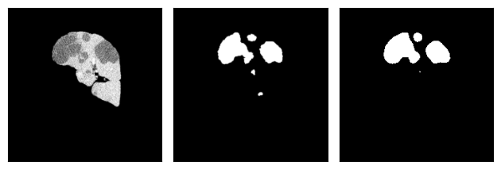

# Liver Tumor Segmentation

> Suhas | 2024

> kaggle: ag3ntsp1d3rx

## Kaggle

* https://www.kaggle.com/datasets/ag3ntsp1d3rx/litsdataset2
* https://www.kaggle.com/code/ag3ntsp1d3rx/litstumorprep
* https://www.kaggle.com/datasets/ag3ntsp1d3rx/litstrained
* https://www.kaggle.com/code/ag3ntsp1d3rx/litsliver
* https://www.kaggle.com/code/ag3ntsp1d3rx/litstumor

## Results

### Liver

Preparation: [Missing](http://http.cat/404)

Notebook: [litsliver.ipynb](./litsliver.ipynb)

                

* Dice score: **0.97**
* Model: Unet++ 
    - encoder: Efficientnet-b5
    - decoder: 5 levels

* Loss: Dice Loss
* Optimizer: RMSProp
* Epochs: 5

### Tumor

Preparation: [litstumourprep.ipynb](./litstumorprep.ipynb)

Model: [litstumor.ipynb](./litstumor.ipynb)

* Dice score: **0.82**

* Model: Unet++ 
    - encoder: Efficientnet-b5
    - decoder: 5 levels

* Loss: Dice Loss
* Optimizer: RMSProp        
* Epochs: 5
* Threshold: 0.99
